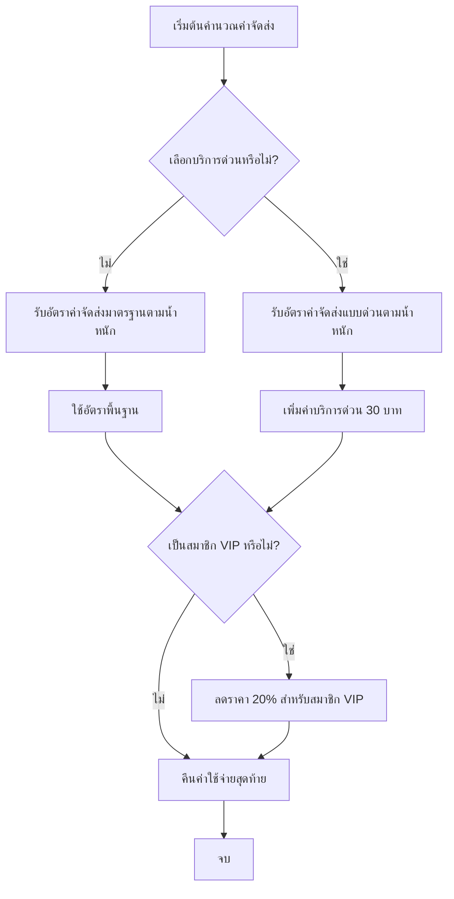

# โปรแกรมคำนวณค่าจัดส่งสินค้า

## ผังงาน (Flowchart)



## รหัสเทียม (Pseudocode)

```
BEGIN โปรแกรมคำนวณค่าจัดส่ง

    // ค่าคงที่สำหรับอัตราค่าจัดส่งมาตรฐาน
    อัตรา_0_ถึง_1_กก = 40.0
    อัตรา_1_ถึง_3_กก = 60.0
    อัตรา_3_ถึง_5_กก = 80.0
    อัตรา_มากกว่า_5_กก = 100.0

    // ค่าคงที่สำหรับอัตราค่าจัดส่งแบบด่วน
    อัตราด่วน_0_ถึง_1_กก = 60.0
    อัตราด่วน_1_ถึง_3_กก = 90.0
    อัตราด่วน_3_ถึง_5_กก = 120.0
    อัตราด่วน_มากกว่า_5_กก = 150.0

    // ค่าคงที่เพิ่มเติม
    ค่าบริการด่วน = 30.0
    อัตราราคาสมาชิก_VIP = 0.20

    ฟังก์ชัน คำนวณค่าจัดส่ง(น้ำหนัก, บริการด่วน, สถานะVIP)
        ถ้า บริการด่วน แล้ว
            อัตราพื้นฐาน = รับอัตราด่วน(น้ำหนัก)
        ไม่เช่นนั้น
            อัตราพื้นฐาน = รับอัตรามาตรฐาน(น้ำหนัก)
        จบถ้า

        ถ้า บริการด่วน แล้ว
            อัตราพื้นฐาน = อัตราพื้นฐาน + ค่าบริการด่วน
        จบถ้า

        ถ้า สถานะVIP แล้ว
            อัตราพื้นฐาน = อัตราพื้นฐาน * (1 - อัตราราคาสมาชิก_VIP)
        จบถ้า

        คืนค่า อัตราพื้นฐาน
    จบฟังก์ชัน

    ฟังก์ชัน รับอัตรามาตรฐาน(น้ำหนัก)
        ถ้า น้ำหนัก <= 1.0 แล้ว
            คืนค่า อัตรา_0_ถึง_1_กก
        แต่ถ้าน้ำหนัก <= 3.0 แล้ว
            คืนค่า อัตรา_1_ถึง_3_กก
        แต่ถ้าน้ำหนัก <= 5.0 แล้ว
            คืนค่า อัตรา_3_ถึง_5_กก
        ไม่เช่นนั้น
            คืนค่า อัตรา_มากกว่า_5_กก
        จบถ้า
    จบฟังก์ชัน

    ฟังก์ชัน รับอัตราด่วน(น้ำหนัก)
        ถ้า น้ำหนัก <= 1.0 แล้ว
            คืนค่า อัตราด่วน_0_ถึง_1_กก
        แต่ถ้าน้ำหนัก <= 3.0 แล้ว
            คืนค่า อัตราด่วน_1_ถึง_3_กก
        แต่ถ้าน้ำหนัก <= 5.0 แล้ว
            คืนค่า อัตราด่วน_3_ถึง_5_กก
        ไม่เช่นนั้น
            คืนค่า อัตราด่วน_มากกว่า_5_กก
        จบถ้า
    จบฟังก์ชัน

END โปรแกรมคำนวณค่าจัดส่ง
```

## คำอธิบายตรรกะ

1. โปรแกรมจะกำหนดอัตราค่าจัดส่งพื้นฐานตามน้ำหนักของพัสดุและประเภทบริการที่เลือก (ด่วนหรือมาตรฐาน)
2. หากเลือกบริการด่วน จะมีการเพิ่มค่าบริการอีก 30 บาท
3. หากลูกค้าเป็นสมาชิก VIP จะได้รับส่วนลด 20% จากค่าจัดส่งทั้งหมด
4. ช่วงน้ำหนักจะกำหนดค่าใช้จ่ายพื้นฐานตามกฎต่อไปนี้:
   - 0-1 กก.: มาตรฐาน=40 บาท, ด่วน=60 บาท
   - 1-3 กก.: มาตรฐาน=60 บาท, ด่วน=90 บาท
   - 3-5 กก.: มาตรฐาน=80 บาท, ด่วน=120 บาท
   - มากกว่า 5 กก.: มาตรฐาน=100 บาท, ด่วน=150 บาท
