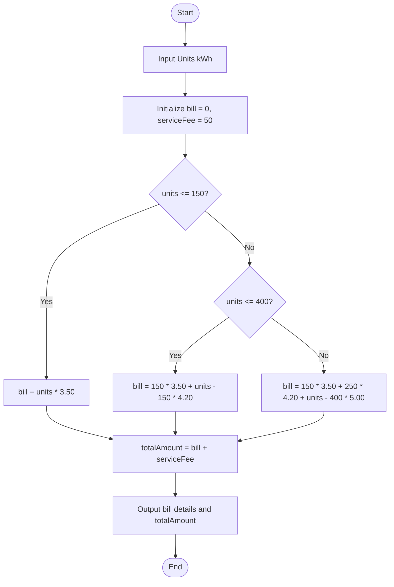

# Electricity Calculator Flowchart

## รายละเอียดผังงาน (Thai)
1. **เริ่มต้น**: รับค่าหน่วยการใช้ไฟฟ้า (kWh) จากผู้ใช้
2. **ตรวจสอบเงื่อนไข**:
    - หากใช้ไฟ **ไม่เกิน 150 หน่วย**: คำนวณที่อัตรา 3.50 บาท/หน่วย
    - หากใช้ไฟ **151 - 400 หน่วย**: 150 หน่วยแรกคิด 3.50 บาท ส่วนที่เกินคิด 4.20 บาท/หน่วย
    - หากใช้ไฟ **เกิน 400 หน่วย**: 150 หน่วยแรกคิด 3.50 บาท, 250 หน่วยต่อมาคิด 4.20 บาท และส่วนที่เหลือคิด 5.00 บาท/หน่วย
3. **คำนวณยอดรวม**: นำค่าไฟพื้นฐานที่คำนวณได้บวกกับค่าบริการคงที่ 50 บาท
4. **แสดงผล**: แสดงรายละเอียดค่าไฟและยอดที่ต้องชำระทั้งหมด
