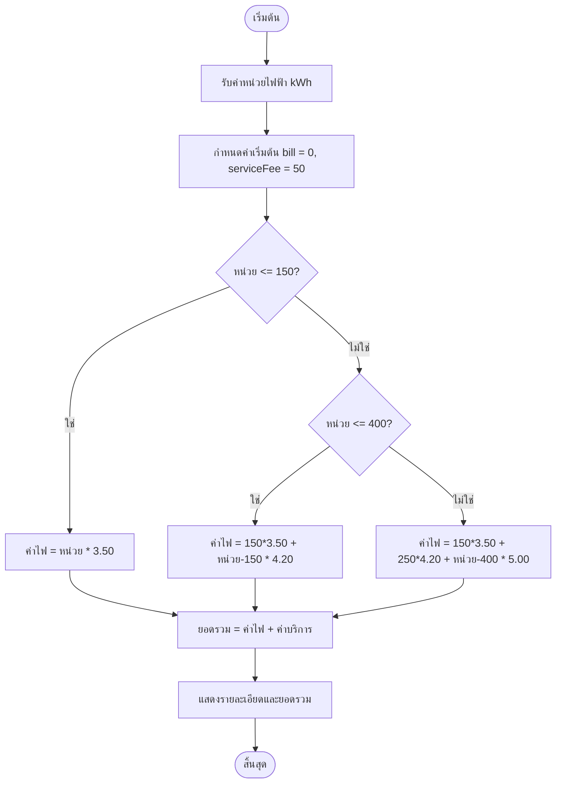

# ผังงานโปรแกรมคำนวณค่าไฟฟ้า

## รายละเอียดขั้นตอน
1. **เริ่มต้น**: รับข้อมูลจำนวนหน่วยไฟฟ้าที่ใช้ (kWh)
2. **เงื่อนไขการคำนวณ**:
    - **0 - 150 หน่วย**: คิดหน่วยละ 3.50 บาท
    - **151 - 400 หน่วย**: ส่วนที่เกิน 150 หน่วย คิดหน่วยละ 4.20 บาท
    - **401 หน่วยขึ้นไป**: ส่วนที่เกิน 400 หน่วย คิดหน่วยละ 5.00 บาท
3. **ยอดสุทธิ**: นำค่าไฟที่คำนวณได้บวกเพิ่มค่าบริการคงที่ 50 บาท
4. **แสดงผล**: พิมพ์สรุปยอดที่ต้องชำระออกทางหน้าจอ
